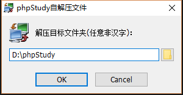
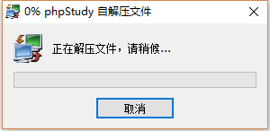
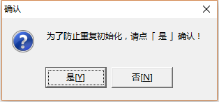
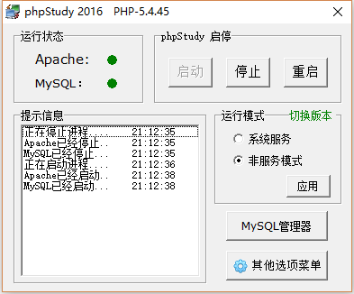
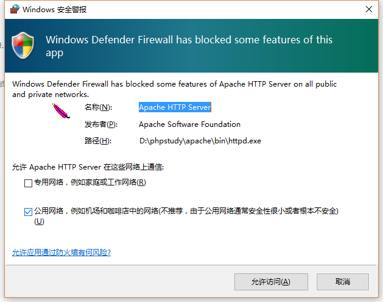
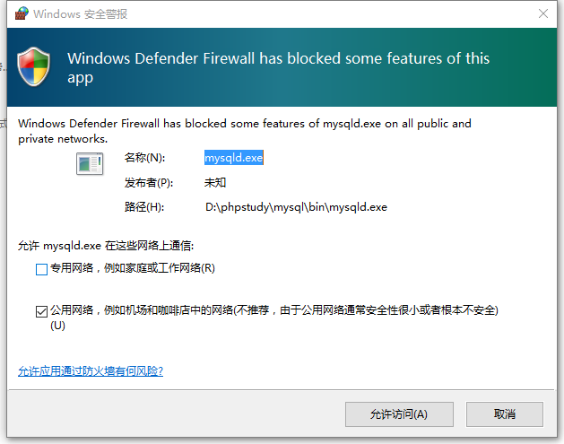
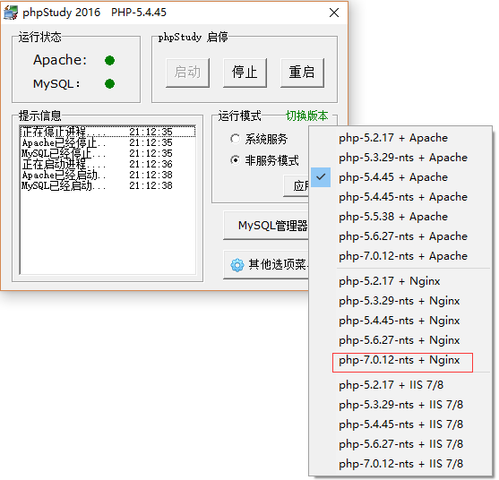
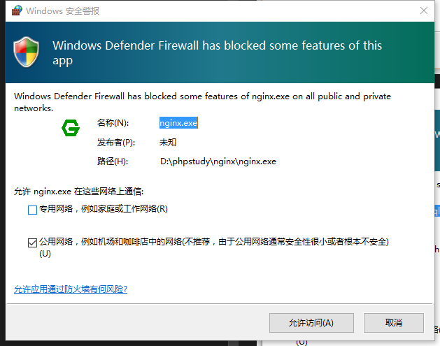
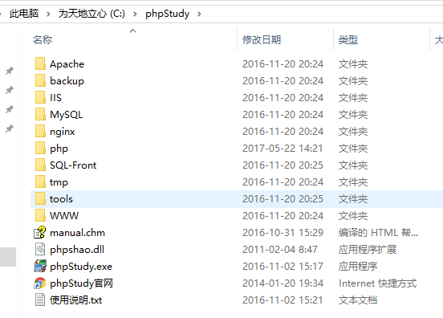
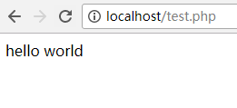

## 环境依赖
操作系统需要在win7以上，推荐win10。

php7需要vc14，下载地址：https://www.microsoft.com/zh-CN/download/details.aspx?id=52685 ，请下载并安装。

## 安装php环境
这里我推荐使用phpstudy集成套件。

下载地址:http://www.phpstudy.net/phpstudy/phpStudy20161103.zip

解压下载的phpStudy20161103.zip，运行phpStudy20161103.exe，选择安装目录。

​​​​​​​

安装过程:

​​​​​​​

安装完成会弹出一个确认对话框，确认即可：

​​​​​​​

安装成功:

​​​​​​​


会有安全提示，全部点『允许访问』

​​​​​​​

​​​​​​​

使用新版php，并切换为nginx(选择红色方框勾选的内容):



此时会出现nginx的网络安全提示，点『允许访问』即可：




进入phpstudy安装目录:



WWW就是代码目录，进入这个目录。

## 安装编辑器

vs code：

下载页：https://code.visualstudio.com/download

下载链接：https://go.microsoft.com/fwlink/?LinkID=623230

安装过程略……，主要关联文件类型。

## 编辑第一行代码

进入『安装php环境』里面的www目录，右键新建文本文件，然后将文件命名为『test.php』，最后右键『open with code』，现在进入vs code，就可以开始写代码了。

输入以下内容：
```
<?php
echo "hello world";
```

在浏览器打开http://localhost/test.php



现在你的php开发环境已经搭建好，第一个hello world已经输出，你开始了你的编程之路。